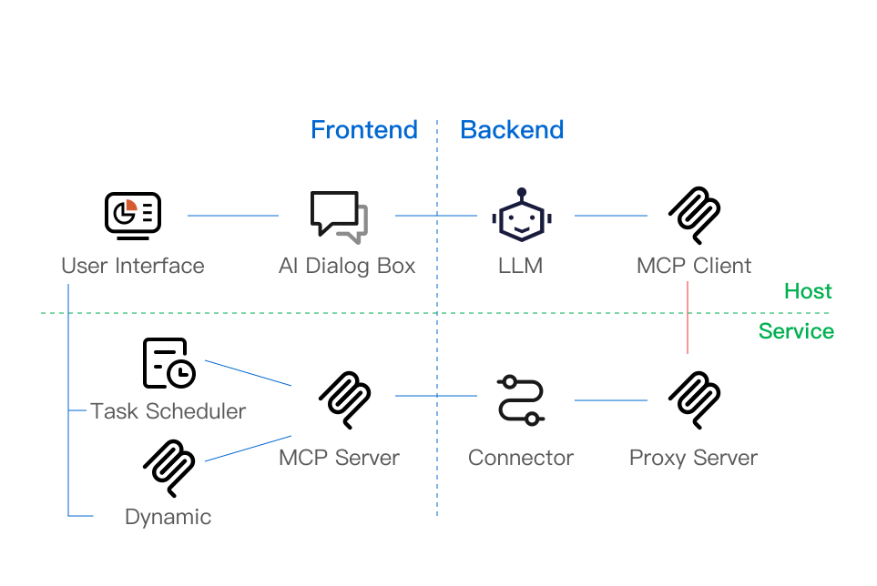

<p align="center">
  <a href="" target="_blank" rel="noopener noreferrer">
    
    <span style="font-size: 36px; vertical-align: middle; margin-left: 24px">OpenTiny TinyAgent</span>
  </a>
</p>
<p align="center">Enable AI to understand and operate user interfaces based on MCP protocol to complete user tasks.</p>

[English](README.md) | [简体中文](README.zh-CN.md)

## 🌈 Features

- **MCP Protocol Support** Supports MCP client + FunctionCall/ReAct mode for large language models
- **Task Scheduling Instructions** Supports human-computer interaction simulation, allowing AI to operate user interfaces with human intervention
- **Extensible Operations** Rich human-computer interaction simulation, supporting component module API-specific extensions
- **Development Toolkit** Easily mark and orchestrate to generate website user manuals that AI can understand

<p align="center">
  
</p>

## How to Use

### Using MCP Server

**In Backend**

Install backend dependencies with the following command:

```bash
npm i @opentiny/tiny-agent-mcp-proxy-server @opentiny/tiny-agent-mcp-connector -S
```

Usage:

```js
import { ProxyServer } from '@opentiny/tiny-agent-mcp-proxy-server';
import {  ConnectorCenter, WebSocketEndpointServer } from '@opentiny/tiny-agent-mcp-connector';

// Create a proxy server
const server = new ProxyServer()

// Create a websocket connector for frontend connection
const connectorCenter = new ConnectorCenter<WebSocketServerEndpoint>();
const webSocketEndpointServer = new WebSocketEndpointServer({ port: 8082 }, connectorCenter);
webSocketEndpointServer.start();

// Connect mcp server to connector
server.setEndPoint(connectorCenter.getClient(clientId, sessionId)); // clientId, sessionId from request or other channels
server.setVerifyCode(verifyCode); // Set verification code
server.connect(transport); // Connect transport, transport needs to be implemented
```

**In Frontend**

Install dependencies with the following command:

```bash
npm i @opentiny/tiny-agent-mcp-service-vue @opentiny/tiny-agent-mcp-service @opentiny/tiny-agent-mcp-connector @opentiny/tiny-agent-task-mcp -S
```

Add a static MCP tool configuration file:

```json
{
  "tools": [
    {
      "name": "fillName",
      "description": "Input name",
      "inputSchema": {
        "type": "object",
        "properties": {
          "name": {
            "type": "string",
            "description": "Username"
          }
        }
      },
      "task": {
        "instructions": [
          {
            "action": "input",
            "params": {
              "selector": ".user-input input",
              "value": "{{name}}"
            }
          }
        ]
      }
    }
  ]
}
```

```js
import { setupMcpService, useMcpService } from '@opentiny/tiny-agent-mcp-service-vue'
import { McpValidator } from '@opentiny/tiny-agent-mcp-service'
import { EndpointTransport, WebSocketClientEndpoint } from '@opentiny/tiny-agent-mcp-connector'
import { executableTaskSchema, McpToolParser } from '@opentiny/tiny-agent-task-mcp'

const mcpValidator = new McpValidator()
const mcp = setupMcpService()
// Connect to backend
function getWebSocketClientEndpoint() {
  return new WebSocketClientEndpoint({ url: 'ws://localhost:8082' })
}
const endpointTransport = new EndpointTransport(getWebSocketClientEndpoint)
mcp.mcpServer.connect(endpointTransport)
mcp.setValidator(mcpValidator)

// Extract and register tools
new McpToolParser(doTask).extractAllTools(mcpToolJson).forEach((tool) => {
  mcp.mcpServer.registerTool(tool.name, tool.config, tool.cb)
})

const { tool } = useMcpService()
const log = () => console.log('log tool')
// Dynamically register an MCP tool
tool(
  'name',
  'description',
  {}, // Parameter validation, can be used with zod
  () => {
    log()
  }
)
```

### Using MCP Client Chat

**Install Dependencies**

Install dependencies with the following command:

```bash
npm i @opentiny/tiny-agent-mcp-client-chat -S
```

**Usage**

```js
const mcpClientChat = await createMCPClientChat({
  llmConfig: {
    url: 'https://openrouter.ai/api/v1/chat/completions', // llm interface
    apiKey: '<your-api-key>',
    model: 'mistralai/mistral-7b-instruct:free',
    systemPrompt: 'You are a helpful assistant with access to tools.'
  },
  maxIterationSteps: 3, // Maximum iteration count
  mcpServersConfig: {
    // Configure connection to multiple MCP Servers
    mcpServers: {
      'localhost-mcp': {
        url: `xxx`,
        headers: {},
        timeout: 60
      },
      'localhost-mcp2': {
        url: `xxx2`,
        headers: {},
        timeout: 60
      }
    }
  }
})
```

### Using Scheduler

**Install Dependencies**

The scheduler needs to be used with the operation library. Install TinyAgent's scheduler and official operation library with the following command:

```bash
npm i @opentiny/tiny-agent-task-runtime-service @opentiny/tiny-agent-task-action-lib -S
```

**Usage**
You can directly import and use it in `main.js`:

```js
import {
  BaseActions,
  FormActions,
  VueRouterActions,
  GuideActions,
  AxiosActions,
  TinyVueActions
} from '@opentiny/tiny-agent-task-action-lib'
import { createScheduler } from '@opentiny/tiny-agent-task-runtime-service'

// Create scheduler and integrate operation library
export const { taskScheduler, actionManager } = createScheduler(
  [...BaseActions, ...FormActions, ...VueRouterActions, ...GuideActions, ...AxiosActions, ...TinyVueActions],
  {} // You can provide your own context for the operation library, such as axios and router
)
```

## Development

```sh
# Clone code to local
$ git clone git@github.com:opentiny/tiny-agent.git

# Install pnpm globally
$ npm install pnpm -g

# Install dependencies
$ cd tiny-agent/ && pnpm install

# Start
$ pnpm dev
```

Open browser and visit: `http://localhost:5173/`

### Environment Configuration

Copy the contents from `demo-server/.env-example` to `demo-server/.env` and fill in your own API key.

### 🤝 Contributing

If you're interested in our open source project, we welcome you to join us! 🎉

Please read the [Contributing Guide](CONTRIBUTING.md) before contributing.
