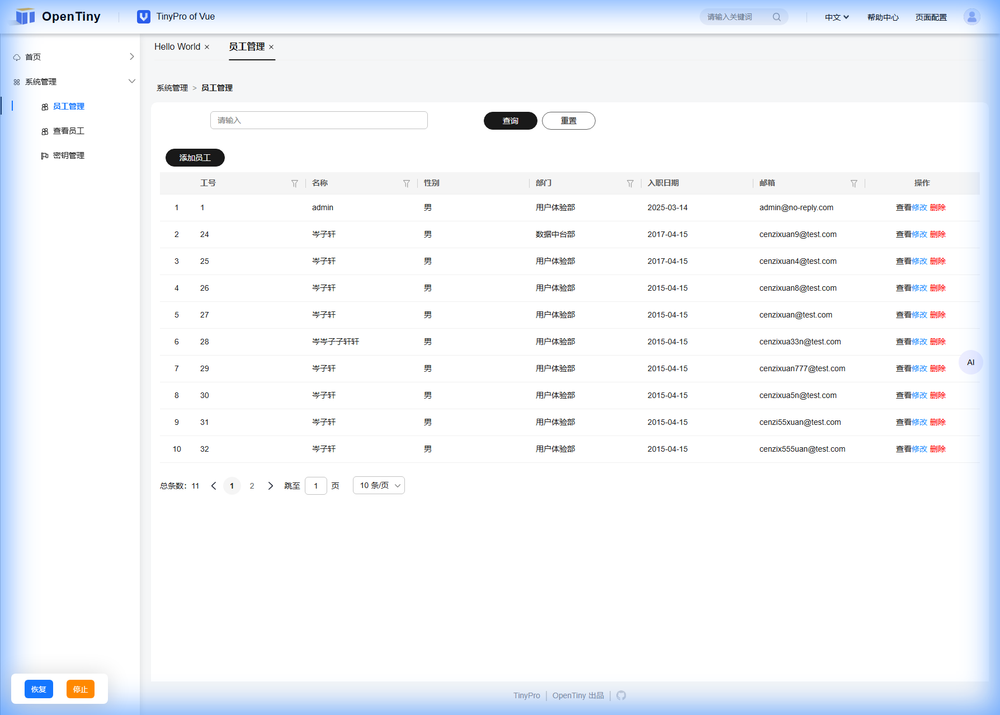

# 自定义调度器界面UI

调度器界面UI支持由用户完全自定义，只需自定义的UI满足以下`ITaskUI`类型即可。

```typescript
type ITaskUIEvent = 'skip' | 'pause' | 'resume' | 'stop';
interface ITaskUI {
  show(): void;
  hide(): void;
  destroy(): void;
  stop(isEmit?: boolean): void;
  pause(isEmit?: boolean): void;
  skip?: (isEmit?: boolean) => void;
  resume(isEmit?: boolean): void;
  on(event: ITaskUIEvent, callback: (...args: any[]) => void): void;
  off(event: ITaskUIEvent, callback: (...args: any[]) => void): void;
}
```

其中`show` `hide` `destroy`三个方法分别是用于界面的显示、隐藏以及元素的销毁。

`pause` `skip` `resume` `stop`分别对应点击暂停执行、调试执行、恢复执行与停止执行。入参`isEmit`用于是否触发相关事件。

`on`和`off`用于提供上述四个方法的事件监听与销毁。

## 参考示例

```typescript
import type { ITaskUI, ITaskUIEvent } from '@opentiny/tiny-agent-task-runtime-service';
import { EventEmitter } from '@opentiny/tiny-agent-task-runtime-service';

export enum Status {
  Stop = 'stop',
  Running = 'running',
  Paused = 'paused',
}

const createBtn = (title: string, type?: string) => {
  const button = document.createElement('button');
  button.innerText = title;
  const backgroundColor = type === 'warn' ? '#ff8800' : '#1476ff';
  Object.assign(button.style, {
    backgroundColor,
    color: '#fff',
    border: 'none',
    padding: '8px 12px',
    cursor: 'pointer',
    borderRadius: '6px',
    margin: '0 12px',
  });
  return button;
};

export class CustomTaskUI implements ITaskUI {
  protected btnBox: HTMLDivElement;
  protected pauseBtn!: HTMLButtonElement;
  protected stopBtn!: HTMLButtonElement;
  protected resumeBtn!: HTMLButtonElement;
  protected light: HTMLDivElement;
  protected emitter: EventEmitter;

  constructor() {
    this.light = this.createBreathingLight();
    this.btnBox = this.createBtnBox();
    this.init();
    this.emitter = new EventEmitter();
  }

  on(event: ITaskUIEvent, callback: (...args: any[]) => void): void {
    this.emitter.on(event, callback);
  }

  off(event: ITaskUIEvent, callback?: (...args: any[]) => void): void {
    this.emitter.off(event, callback);
  }

  protected emit(event: ITaskUIEvent, ...args: any[]): void {
    this.emitter.emit(event, ...args);
  }

  protected createBtnBox() {
    const box = document.createElement('div');
    const boxStyles = {
      position: 'fixed',
      bottom: '20px',
      left: '20px',
      padding: '0 12px',
      backgroundColor: 'white',
      borderRadius: '8px',
      boxShadow: '0 2px 40px rgba(0, 0, 0, 0.16)',
      height: '54px',
      display: 'flex',
      alignItems: 'center',
      zIndex: '10000',
    };
    Object.assign(box.style, boxStyles);
    document.body.appendChild(box);
    return box;
  }

  protected init() {
    this.stopBtn = createBtn('停止', 'warn');
    this.stopBtn.onclick = () => this.stop(true);

    this.pauseBtn = createBtn('暂停');
    this.pauseBtn.onclick = () => this.pause(true);

    this.resumeBtn = createBtn('恢复');
    this.resumeBtn.onclick = () => this.resume(true);

    this.btnBox.append(this.pauseBtn, this.stopBtn);

    this.hide(); // 初始化时隐藏
  }

  setStatus(status: Status) {
    if (status === Status.Running) {
      this.btnBox.replaceChildren(this.pauseBtn, this.stopBtn);
      this.continueLight();
    } else if (status === Status.Paused) {
      this.btnBox.replaceChildren(this.resumeBtn, this.stopBtn);
      this.pauseLight();
    } else if (status === Status.Stop) {
      this.btnBox.replaceChildren(this.pauseBtn, this.stopBtn);
      this.pauseLight();
    }
  }

  hide() {
    this.btnBox.style.display = 'none';
    this.light.style.display = 'none';
  }

  show() {
    this.btnBox.style.display = 'flex';
    this.light.style.display = 'block';
  }

  pause(isEmit: boolean = false) {
    if (isEmit) {
      this.emit('pause');
    }
    this.setStatus(Status.Paused);
  }

  resume(isEmit: boolean = false) {
    if (isEmit) {
      this.emit('resume');
    }
    this.setStatus(Status.Running);
  }

  stop(isEmit: boolean = false) {
    if (isEmit) {
      this.emit('stop');
    }
    this.setStatus(Status.Stop);
    this.hide();
  }

  protected createBreathingLight() {
    const light = document.createElement('div');
    light.classList.add('task-run-shadow');
    light.style.display = 'block';
    document.body.appendChild(light);

    const style = document.createElement('style');
    style.textContent = `
      @keyframes shadow_fade {
          0%, to {
              box-shadow: inset 10px 10px 30px 0 rgba(20,118,255, 0.3), inset -10px -10px 30px 0 rgba(20,118,255, 0.3);
          }
          50% {
              box-shadow: inset 20px 20px 60px 0 rgba(20,118,255, 0.5), inset -20px -20px 60px 0 rgba(20,118,255, 0.5);
          }
      }
      .task-run-shadow {
          animation: shadow_fade 2.5s ease-in-out infinite;
          bottom: 0;
          display: none;
          height: 100vh;
          left: 0;
          pointer-events: none;
          position: fixed;
          right: 0;
          top: 0;
          width: 100vw;
          z-index: 9999;
          animation-play-state: running;
      }
  `;
    document.head.appendChild(style);
    return light;
  }

  destroy() {
    if (this.light && document.body.contains(this.light)) {
      document.body.removeChild(this.light);
    }
    if (this.btnBox && document.body.contains(this.btnBox)) {
      document.body.removeChild(this.btnBox);
    }
  }

  protected pauseLight() {
    this.light.style.animationPlayState = 'paused';
  }

  protected continueLight() {
    this.light.style.animationPlayState = 'running';
  }
}
```

## 链接UI

完成自定义UI后，通过调度器的`connectTaskUI`方法链接到自定义UI

```typescript
import { ActionManager, TaskScheduler } from '@opentiny/tiny-agent-task-runtime-service';
import { BaseActions } from '@opentiny/tiny-agent-task-action-lib';
const actionManager = new ActionManager();
const taskUI = new CustomTaskUI();
const taskScheduler = new TaskScheduler(actionManager, context);
// 链接自定义的UI
taskScheduler.connectTaskUI(taskUI);
actionManager.registerActions(BaseActions);
```

## 自定义UI预览

下图是上述自定义UI示例的预览图

<p align="center">
  
</p>
