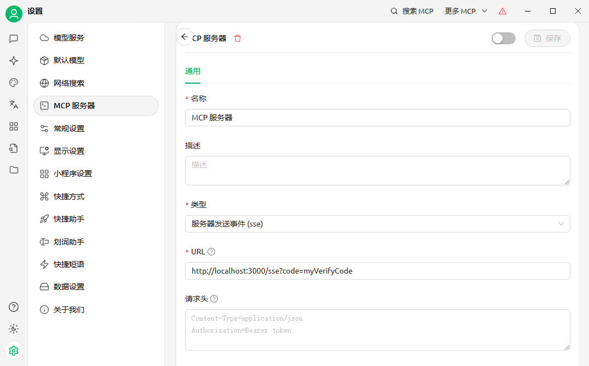
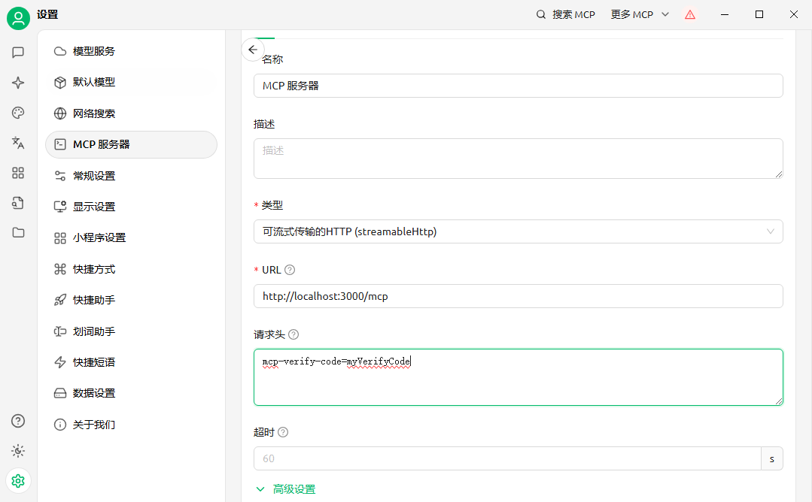

# McpValidator拓展

如果阅读过[McpValidator API](https://github.com/opentiny/tiny-agent/blob/main/docs/src/api/mcp/mcp-service/mcp-validator.md)，那可以知道McpValidator主要是负责MCP工具调用校验。

## 如何开发一个自定义的McpValidator？

我们先来剖析下McpValidator，其中

- genVerifyCode方法用于生成验证码，
- verify提供给mcpService用于在工具调用时进行校验，
- clearVerifyCode用于一轮交互后清除验证码，即验证码失效策略。

因此可以按照[McpValidator API](https://github.com/opentiny/tiny-agent/blob/main/docs/src/api/mcp/mcp-service/mcp-validator.md)提供的API列表进行自定义实现并应用于TinyAgent。

## 如何在其他平台配置使用并校验通过？

- SSE：需要在访问的URL加上code参数，code参数即McpValidator genVerifyCode方法所生成的验证码，这里需要约定一个验证码在项目启动时则通过genVerifyCode获取到。
- Steamable：在访问的URL请求的请求头中加上mcp-verify-code: your code

```typescript
class CustomMcpValidator {
  protected verifyCode?: string;

  genVerifyCode = async () => {
    // 此处静态约定verifyCode为myVerifyCode，当然，也可以采用动态的方式通过console.log在控制台获取到
    const nonceCode = 'myVerifyCode';
    this.verifyCode = nonceCode;
    return nonceCode;
  };

  async verify(code: string) {
    return this.verifyCode && this.verifyCode === code;
  }

  clearVerifyCode() {
    this.verifyCode = undefined;
  }
}

// 项目启动代码中
const mcpService = setupMcpService();
const mcpValidator = new CustomMcpValidator();

mcpService.setValidator(mcpValidator);
// 生成验证码的具体时机可以自行调整
mcpValidator.genVerifyCode();
```

**Cherry Studio配置SSE类型MCP Server**



**Cherry Studio配置Steamable类型MCP Server**


